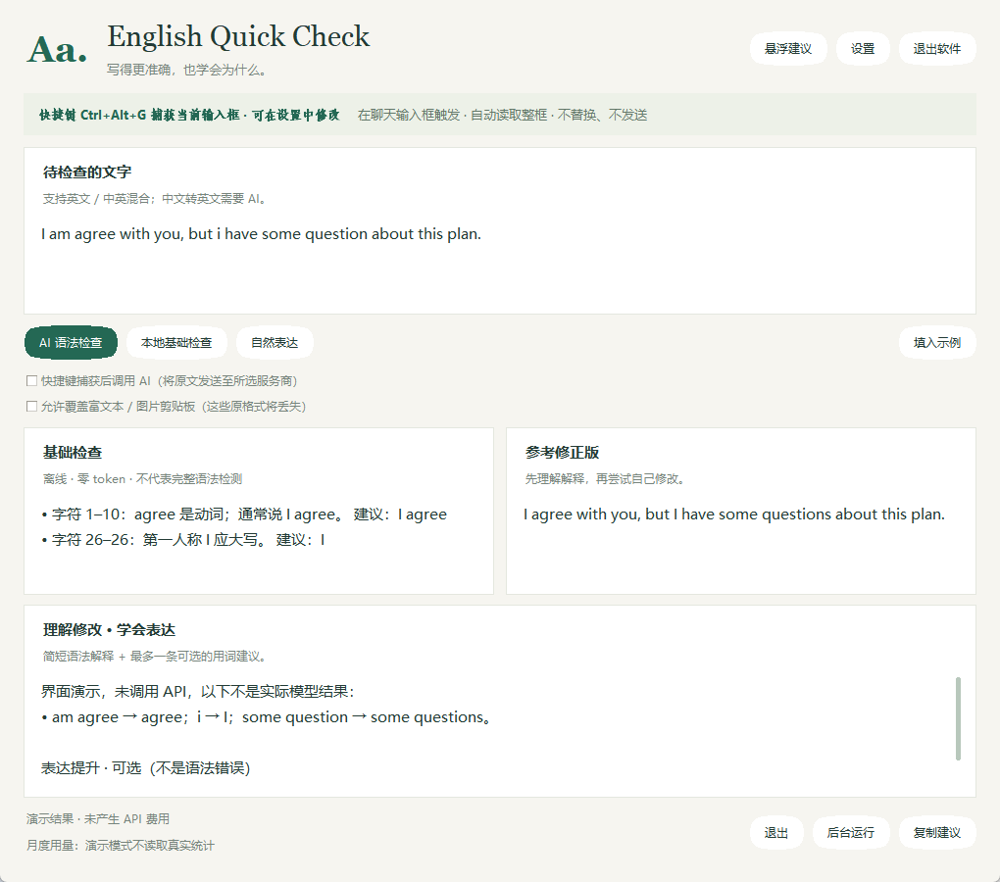
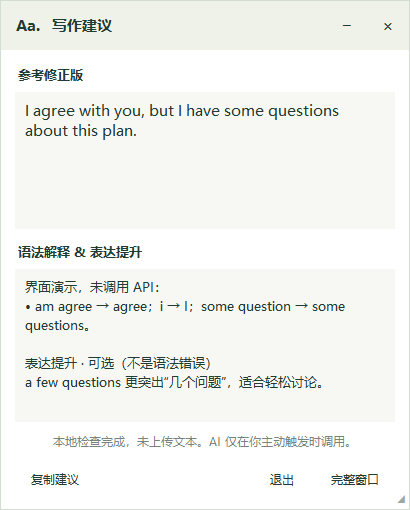

# English Quick Check · 轻量英文写作助手

Windows 轻量桌面助手（v0.2.2）：本地基础规则 + 按需 DeepSeek / OpenAI 兼容 API。无 Java、无 Electron。源码运行仅依赖 Python 标准库；Windows x64 便携发行版自带 Python / Tk，无需另装 Python。自带原生 Windows 系统托盘与统一设置窗口。

## 启动

### Windows 便携版

下载 `English-Quick-Check-v0.2.2-windows-x64.zip`，**解压整个文件夹**后双击 `English Quick Check.exe`。没有命令行黑框，无需安装 Python。必须保留同级 `_internal` 文件夹；不能只复制 exe。设置和月度用量仍保存在当前用户的 `%LOCALAPPDATA%\EnglishQuickCheck`，因此“便携”指无需安装，不代表数据随文件夹移动。

当前为未签名的早期版本，SmartScreen 可能提示未知发布者；请从可信发布页下载并核对 SHA256，不要关闭安全软件。仅在本机验证，其他 Windows 版本、DPI、杀毒环境仍需实际验证。

## 界面预览

### 主窗口


### 悬浮建议窗口


### 源码运行

需要 Windows、Python 3.10+ 和 Tkinter。

双击 `启动英文助手.bat`，或在本目录运行：

```powershell
python app.py
```

需要 Python 3.10+ 且带 Tkinter；标准 Windows Python 安装通常包含 Tkinter。默认启动显示主窗口；普通最小化保留任务栏入口，“后台运行”进入系统托盘。默认主窗口“×”或任务栏“关闭窗口”也进入托盘；设置中可改为直接退出。托盘双击打开主窗口，右键提供“打开主窗口 / 退出”；图标可能在任务栏右侧“^”隐藏图标内。主窗口右上角也有“退出软件”。托盘不可用时，关闭主窗口会直接退出，后台按钮则最小化到任务栏。默认快捷键为 Ctrl+Alt+G，可在“设置 → 常规”修改，保存后立即生效并在下次启动沿用。支持 Ctrl / Alt / Shift 加字母、数字或 F1–F24，至少包含 Ctrl 或 Alt；若被占用，会保留原快捷键，仍可手动粘贴。

只想看演示（不注册快捷键、不读取保存的设置、不会发送网络请求）：

```powershell
python app.py --demo
```

## 怎么用

1. 将英文粘贴到窗口，点击“本地基础检查”。离线可用。
2. 点击右上角“设置” → “API 与用量”，选择 DeepSeek，填入自己的 API Key 并保存。
3. 点击“AI 语法检查”：保留原意，给最小修正版与最多 3 条简短中文说明。
4. 想看更自然的用法，再点击“自然表达”。这是独立的一次 API 请求，润色不是语法错误判定。
5. 点击“复制建议”，自行粘贴。不会自动替换、不会自动发送。

快捷键：先点击其他软件的聊天输入框，再按并松开 `Ctrl + Alt + G`，程序自动执行 Ctrl+A、Ctrl+C，读取整个输入框；无需手动全选。默认仅执行本地规则。明确勾选“快捷键捕获后同时调用 AI”后，快捷键才会触发上传。注意：如果焦点不在输入框，可能全选整页；通用快捷键不是可靠的输入框识别，务必先确认焦点。

已移除“替换原输入框”功能及其粘贴逻辑。推荐学习流程：查看错误原因 → 自己修改输入框中的句子 → 再按快捷键检查。保留参考修正版和“复制建议”作为可选辅助，不自动修改任何外部输入框，不发送消息。

## 悬浮建议模式

推荐流程：启动主窗口 → 配置 API / 快捷键 AI 开关 → 点击“后台运行”或最小化 → 在聊天输入框按 Ctrl+Alt+G → 自动弹出悬浮建议。无需先启用悬浮，也无需手动关闭主界面。进入后台后双击托盘图标，或使用其右键菜单恢复主窗口。普通最小化仍保留任务栏入口。

- 悬浮窗只展示参考修正版、简短解释和检查状态，不是检查面板，不提供输入框或检查按钮。
- 每次快捷键捕获都显示悬浮窗，不主动恢复主窗口；捕获失败也在悬浮窗内提示。如需快捷键直接 AI 检查，先在主窗口勾选相应开关。
- 按住浅绿色标题栏拖动位置；“−”折叠 / 展开卡片；“×”只隐藏悬浮窗，不退出程序、不弹出主窗口；下次快捷键会重新展开并显示。
- “完整窗口”主动打开主窗口；主窗口右上角“悬浮建议”仍可手动显示 / 隐藏卡片。“退出”彻底退出程序。
- 主窗口可拖动边缘缩放 / 最大化（最小 880×720）；悬浮窗默认 410×510，拖动右下角三角手柄缩放（最小 380×400）。本次运行中关闭、重新显示及折叠 / 展开均保留调整后的大小和位置。
- 文本内容随宽度自动换行；缩放时结果和解释区域随之扩展。滚动条已改为无箭头的细滑块，仅内容溢出时显示，可拖动或使用鼠标滚轮。
- 当前不跨重启保存悬浮位置和尺寸；没有自动替换、自动发送或额外 API 请求。
- 新版短时间启动内存实测工作集约 41 MiB（仅本机一次采样，不保证峰值）。预览中的 AI 内容为演示，未请求真实 API。

## 设置与中英混合

设置分为“常规”“检查与捕获”“API 与用量”，保存后下次启动沿用：

- 关闭主窗口：进入托盘（默认）或直接退出。
- 启动时：显示主窗口（默认）或直接进入托盘；这不是 Windows 开机自启。
- 中文处理：转成完整英文（默认），或保留中文只检查英文。
- 快捷键 AI、覆盖富文本剪贴板：默认关闭，主动开启后会保存。主窗口上的两个开关也同步保存。
- API 服务商、地址、模型、加密 Key 与每次运行请求上限。

当检测到汉字时，AI 默认将**整段**中文 / 中英混合内容转为完整英文，整合已有英文并修正语法，保留原意、语气、数字等。解释用中文，翻译不冒充语法错误；不回答原文中的问题，不自动替换外部输入框。若选择“保留中文”，AI 会被要求保留中文并只修改英文部分。

纯英文沿用原有语法检查 / 自然表达模式。中文转英文仍是同一次 AI 请求，不额外调用；检测汉字也可能匹配日文汉字等，不是完整语言识别。模型可能误译，请核对；若转英文结果仍含汉字，会报错而不自动重试，已返回用量仍计入统计。本地规则不翻译，只会提示需要 AI。真实翻译质量尚需实际试用；开发测试使用模拟 API。

## 一条表达提升

每次 AI 检查在同一个请求中附带最多一条可选的用词或搭配建议，单独标为“表达提升 · 可选（不是语法错误）”。最小语法修正版不混入风格润色；没有有价值的建议时返回空字符串，不强行凑建议。不会额外发起请求，但提示词和返回文本略有增加，仍计入 token。主窗口及悬浮窗均展示该建议。AI 仍可能误判，建议不是强制修改。

## API 配置

打开主窗口右上角 **设置 → API 与用量**，填写地址与 API Key，点击 **获取模型列表**，在模型下拉框中选择后点击 **保存全部设置**。列表由配置的服务商返回；不支持列表接口时仍可手动输入模型名称。

获取列表仅请求 `/models` 元数据，不发送聊天测试请求，不会逐个验证模型。列表可能包含非聊天模型，且不保证账号调用权限。网络失败时保留现有选择；配置改变后旧响应会被忽略。模型列表只在当前进程缓存，不写入磁盘，打开设置不会自动联网。

| 服务商 | Base URL | 默认模型 |
|---|---|---|
| DeepSeek | `https://api.deepseek.com/v1` | `deepseek-flash` |
| OpenAI | `https://api.openai.com/v1` | `gpt-4o-mini` |
| 自定义 | 自填 HTTPS 地址 | 自填非推理聊天模型 |

兼容 `POST /chat/completions` 的接口。也接受完整的 `/chat/completions` URL；禁止 HTTP 与携带账号/查询参数的地址；禁止 HTTP 重定向，避免向新地址转发 Key。切换服务商自动清空 Key，避免误发给另一平台。模型可用性、价格和兼容参数以服务商为准；ChatGPT 订阅不包含 OpenAI API 额度。

对 DeepSeek 官方域名 `api.deepseek.com` 的请求显式发送 `thinking: {"type": "disabled"}`，关闭思考模式。OpenAI 与第三方兼容地址不发送这个专用参数。默认模型仍为 `deepseek-flash`；实际支持范围以服务商为准。当前使用非流式响应，要等完整 JSON 返回才显示；长原文对应的输出较长、网络与服务端排队都可能导致延迟，关闭思考不保证固定响应时间。参考：https://api-docs.deepseek.com/guides/thinking_mode/

不强制依赖 response_format 参数，由提示词要求 JSON，并验证结果；若服务返回不合法 JSON、被截断或请求失败，显示错误，不自动重试。

## 资源与费用

- 本机实测：Windows + PATH 上 Python 3.13.9，启动 3 秒后、窗口隐藏、完成一次示例本地检查、快捷键已注册：**Working Set 37.96 MiB / Private Committed 21.13 MiB**。
- 这是一次短时间测量，不是峰值、长期稳定占用或 exe 打包后的保证；未包含真实 API 请求的峰值。
- 只在主动触发时请求 AI；不随每个字输入请求。
- 最多 4000 字符/次；最多 800 输出 token。长原文可能因输出上限不足失败，请分段。
- 每次进程运行默认最多 1000 次 API 请求，可在 API 设置中调整为 1–100000 次（失败请求也算次数），重启后次数清零，设置保留。它不是每日限额，也不是硬性金额预算。
- 最近 20 份相同配置、原文和模式的成功结果缓存在内存；缓存命中不再调用。设置变更清空缓存，退出也清空。
- 展示服务返回的实际输入/输出/总 token；若服务未提供，标为“未提供”。不硬编码价格，账单以服务商为准。
- 本月累计 token 显示输入 / 输出 / 总计，按本机当前年月统计所有服务商在本软件中的用量。数值保存于 `%LOCALAPPDATA%\EnglishQuickCheck\usage.json`，重启保留，跨月单独计数；只保存年月和数值，不保存原文或 Key。
- 缓存不重复累计；即使模型结果格式错误、截断或原文变化导致丢弃结果，只要 API 返回 usage 仍累计。接口没有完整返回用量时显示缺失次数，不能把统计视为完整账单。网络错误/HTTP 错误等未收到 JSON 用量的请求无法统计；旧版本的历史调用不能追溯补算。关闭软件时尚未完成的请求也可能遗漏。
- 非推理模型优先；首版拒绝名字含 reasoner/thinking 的模型，但不能据此保证所有自定义模型均没有推理费用。

## 本地规则的范围

支持第一人称小写 i、相邻重复词、词间多余空格、英文标点前空格，以及 `I am agree` / `I dont` 等少量明确表达。

**不是完整语法检查器，也不是完整拼写词典。** 没找到问题不代表语法正确。重复词可能是有意表达，规则修正版只是候选，不自动应用到原输入框。AI 同样可能误判，始终由你确认。

## 隐私与边界

- 不进行按键监听记录，不读取聊天历史；Windows RegisterHotKey 仅响应配置的快捷键。
- 原文、结果与 API Key 会短暂存在本进程内存。原文和历史结果不写入磁盘；系统层面的页面文件、崩溃转储等不由本软件控制。
- API 设置位于 `%LOCALAPPDATA%\EnglishQuickCheck\settings.json`；Key 使用 Windows DPAPI 当前用户加密保存，不是明文。它不能防御已取得当前 Windows 账号权限的恶意程序。
- 手动 AI 检查会把原文发给所选服务商，数据处理政策由该服务商决定。软件不会额外采集遥测。
- 选区读取模拟一次 Ctrl+C，并尽量恢复先前的纯文本剪贴板；如果中途有新的剪贴板变更，不覆盖新内容。
- **原剪贴板含图片、文件、HTML 或其他富文本格式时，快捷键会拒绝读取**，避免丢失这些格式。请手动复制并粘贴到助手窗口。恢复普通文本也不保证保留剪贴板的所有元数据。
- 密码框、管理员权限窗口、特殊编辑器可能不支持选区捕获。不会自动提升管理员权限。
- 点击“复制建议”会明确覆盖剪贴板，这是用户主动动作。
- 在 API 等待期间修改原文，旧结果会丢弃；已经发出的请求仍可能计费。退出软件不保证撤销服务端计费。
- 暂未实现开机自启、LanguageTool、每日金额预算；已提供原生托盘、便携 exe 和本地月度用量统计。

## 开发者：从源码构建

在 Windows x64 上安装带 Tkinter 的 64 位 Python 3.10+，从项目目录执行：

```powershell
powershell -ExecutionPolicy Bypass -File .\build.ps1
```

脚本创建隔离的 `.venv-build`，安装 `requirements-build.txt` 中的 PyInstaller，运行单元测试及打包后 GUI 离线自检，然后生成 `dist/English Quick Check/` 和 `release/English-Quick-Check-v0.2.2-windows-x64.zip` / `SHA256SUMS.txt`。首次安装构建工具需要联网，但不会调用 AI API。采用文件夹版而非单文件版，避免每次启动解压到临时目录；图标和 0.2.2 版本信息已嵌入。构建依赖只锁定 PyInstaller 主版本，不保证逐字节可复现。

构建包不收集用户目录中的设置、API Key 和用量文件。当前发行版未签名。

## 许可证

本项目采用 [MIT License](LICENSE)，版权归属 © 2026 Presure-Yao。允许使用、修改、分发及商业使用，分发时须保留版权声明与许可证。软件按原样提供，不作担保。

许可证不包含第三方 API 服务的使用权或费用；使用者需自行提供 API Key，并遵守服务商条款。

离线验证打包后的 GUI（演示模式，不读取保存的 Key、不注册快捷键、不联网）：

```powershell
& '.\dist\English Quick Check\English Quick Check.exe' --smoke-test "$PWD\build\smoke-report.json"
```

程序检查本地规则、悬浮窗显示/关闭/重开、托盘图标创建及隐藏/打开主窗口，写出 JSON 并自动退出，退出时删除托盘图标。它不代替真实聊天输入框兼容性和跨机器测试。

## 测试

```powershell
python -m unittest -v test_core test_hotkey test_ui
python smoke_test.py
```

31 项自动测试覆盖本地规则、模拟 API 响应、用量与设置保存、快捷键切换和冲突处理、托盘生命周期、悬浮按钮反馈及模型列表后台加载。模型列表测试使用模拟数据，未验证真实账号的模型权限。

API 测试使用模拟响应，**没有用真实 Key 调用 DeepSeek/OpenAI，也没有产生 API 费用**。快捷键在微信/QQ/浏览器等软件中的实际选区捕获、各服务商真实返回格式以及长时间资源占用，仍需你实际试用验证。

`preview.png` 是真实 Tkinter 窗口截图，截图内 AI 文本为标注清楚的演示结果，不是真实服务商返回。`preview.py` 需要 Pillow，仅用来重新生成开发预览，不是应用运行依赖。
